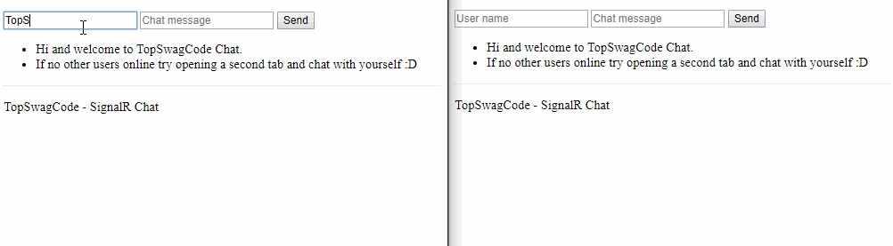
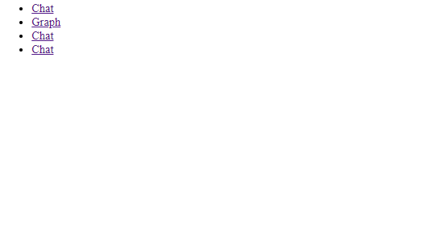
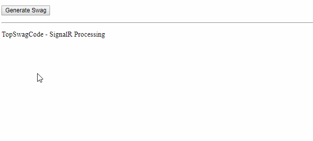
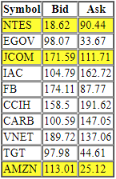

 # TopSwagCode.SignalR

Small work in progress for showcasing stuff to do with WebSockets and how simple it is getting started :)

Contains 4 small sample usages:

* Chat -> Small simple chat between all users.
* Graph -> Shows some numbers to all users. Eg. Admin dashboard.
* Process -> Shows how you could offload some work but still keep your user informed on progress.
* Stocks -> Show how to broadcast complex models using json.

Run app locally:

Start a http server on port 4000 in the wwwroot folder. (My goto is https://www.nuget.org/packages/dotnet-serve/)
install the tool: 

```console
$ dotnet tool install --global dotnet-serve --version 1.2.0
```

run the tool:

```console
$ dotnet-serve -p 4000
```

Now run the Dotnet project by running:

```console
$ dotnet run
```

Now open your browser of chouse at http://localhost:4000 and you should have links to the 4 demo apps as shown below:

# Chat



# Graph



# Processing



# Stock

